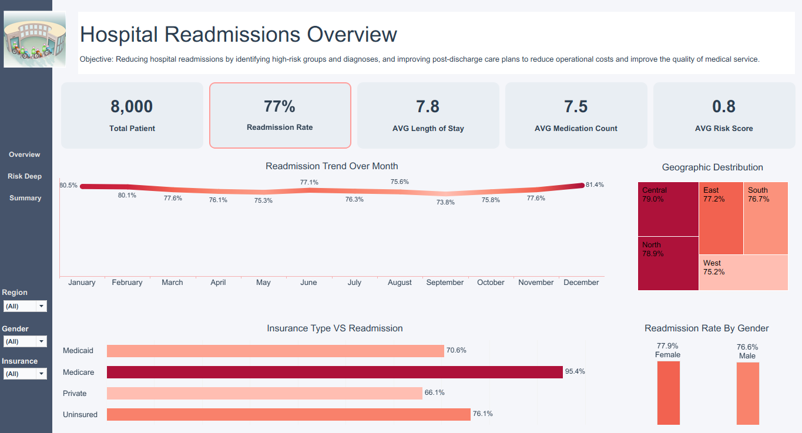
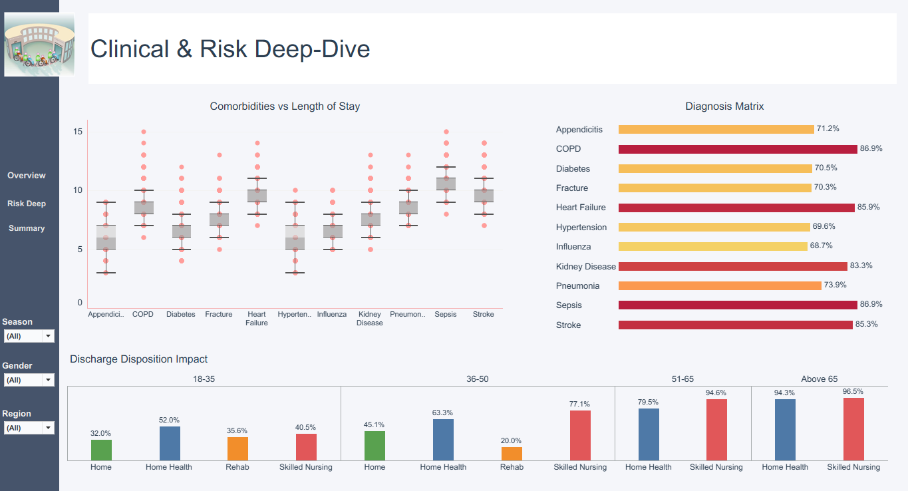
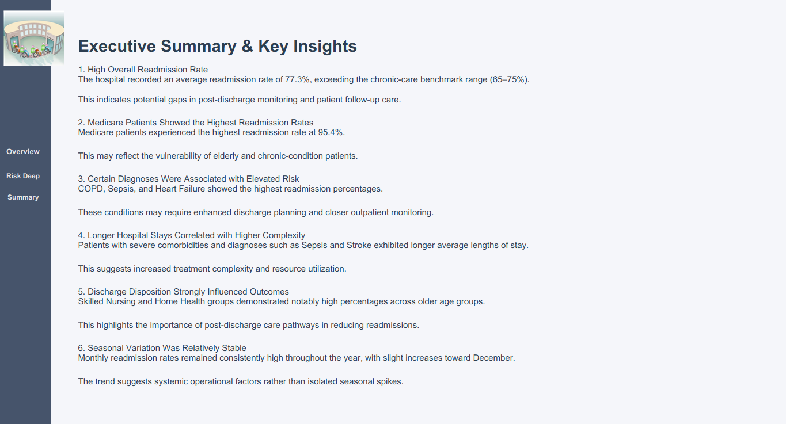

# Hospital Readmission 

## Overview
This project presents an interactive healthcare analytics dashboard built using Tableau Public to analyze hospital readmission patterns, patient risk factors, diagnosis trends, insurance impact, and discharge outcomes.

The dashboard is designed to support healthcare decision-making by identifying high-risk groups and operational areas requiring improvement.

---

## Project Objectives

- Analyze hospital readmission trends
- Identify high-risk diagnoses and patient groups
- Evaluate insurance-related readmission patterns
- Assess discharge disposition effectiveness
- Explore relationships between comorbidities and length of stay
- Deliver actionable healthcare insights through data storytelling

---

## Tools & Technologies

- Tableau Public
- CSV Dataset
- Calculated Fields
- Dashboard Actions & Filters
- KPI Cards
- Interactive Visualizations

---

## Dashboard Pages

### 1. Executive Overview
Provides a high-level summary of hospital performance through:
- KPI cards
- Monthly readmission trends
- Geographic distribution
- Insurance impact analysis
- Gender comparison

### 2. Clinical & Risk Deep-Dive
Focused analytical view containing:
- Diagnosis risk matrix
- Comorbidities vs length of stay
- Discharge disposition impact analysis
- Clinical risk exploration

### 3. Executive Summary
Summarizes the most important business insights and healthcare recommendations.

---

## Key Insights

### High Overall Readmission Rate
- Average readmission rate reached 77.3%, exceeding the chronic-care benchmark range.

### Medicare Patients Showed Elevated Readmissions
- Medicare patients experienced the highest readmission percentages, indicating increased vulnerability among elderly and chronic-condition groups.

### Certain Diagnoses Were High-Risk
- COPD, Sepsis, Heart Failure, and Stroke displayed significantly elevated readmission rates.

### Longer Stays Indicated Greater Clinical Complexity
- Severe diagnoses and multiple comorbidities were associated with extended hospital stays.

### Discharge Type Influenced Outcomes
- Skilled Nursing and Home Health pathways showed strong impact on readmission behavior among older patients.

---

## Features

- Interactive filtering
- Dashboard navigation sidebar
- KPI-driven storytelling
- Trend analysis
- Dynamic healthcare insights
- Risk-focused visualization design

---

## Dashboard Design Highlights

- Clean executive-style layout
- Consistent healthcare-focused color palette
- Responsive dashboard structure
- Separation between overview and deep analytical views
- Business-oriented storytelling approach

---

## Dashboard Preview

---

## Author

Ali Rabie  
Junior Data Analyst | Power BI & Tableau Enthusiast
alirabie0128@gmail.com
